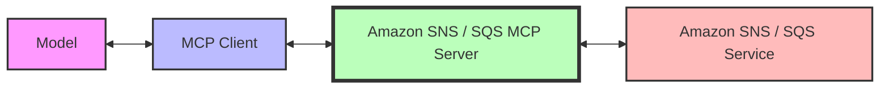

# Amazon SNS / SQS MCP Server

A Model Context Protocol (MCP) server for Amazon SNS / SQS that enables generative AI models to manage SNS Topics and SQS Queues through MCP tools.

## Features

This MCP server acts as a **bridge** between MCP clients and Amazon SNS / SQS, allowing generative AI models to create, configure, and manage Topics / Queues. The server provides a secure way to interact with Amazon SNS / SQS resources while maintaining proper access controls and resource tagging.



From a **security** perspective, this server implements resource tagging to ensure that only resources created through the MCP server can be modified by it. This prevents unauthorized modifications to existing Amazon SNS/SQS resources that were not created by the MCP server.

## Key Capabilities

This MCP server provides tools to:
- Create, list, and manage Amazon SNS topics
- Create, list, and manage Amazon SNS subscriptions
- Create, list, and manage Amazon SQS queues
- Send and receive messages using SNS and SQS

## Prerequisites

1. Install `uv` from [Astral](https://docs.astral.sh/uv/getting-started/installation/) or the [GitHub README](https://github.com/astral-sh/uv#installation)
2. Install Python using `uv python install 3.10`
3. AWS account with permissions to create and manage Amazon SNS / SQS resources

## Setup

### IAM Configuration

1. Provision a user in your AWS account IAM
2. Attach **ONLY** `AmazonSNSFullAccess` and `AmazonSQSFullAccess` to the new user
3. Use `aws configure` on your environment to configure the credentials (access ID and access key)

### Installation

Configure the MCP server in your MCP client configuration (e.g., for Amazon Q Developer CLI, edit `~/.aws/amazonq/mcp.json`):

```json
{
  "mcpServers": {
    "awslabs.amazon-sns-sqs-mcp-server": {
      "command": "uvx",
      "args": ["awslabs.amazon-sns-sqs-mcp-server@latest"],
      "env": {
        "AWS_PROFILE": "your-aws-profile",
        "AWS_REGION": "us-east-1"
      }
    }
  }
}
```

or docker after a successful `docker build -t awslabs/amazon-sns-sqs-mcp-server.`:

```file
# fictitious `.env` file with AWS temporary credentials
AWS_ACCESS_KEY_ID=<from the profile you set up>
AWS_SECRET_ACCESS_KEY=<from the profile you set up>
AWS_SESSION_TOKEN=<from the profile you set up>
```

```json
  {
    "mcpServers": {
      "awslabs.sns-sqs-mcp-server": {
        "command": "docker",
        "args": [
          "run",
          "--rm",
          "--interactive",
          "--env-file",
          "/full/path/to/file/above/.env",
          "awslabs/amazon-sns-sqs-mcp-server:latest"
        ],
        "env": {},
        "disabled": false,
        "autoApprove": []
      }
    }
  }
```
## Server Configuration Options

The Amazon SNS / SQS MCP Server supports several command-line arguments that can be used to configure its behavior:

### `--allow-resource-creation`

Enables tools that create resources in the user's AWS account. When this flag is not enabled, the create new resources tools will be hidden from the MCP client, preventing the creation of new Amazon SNS / SQS resources. It also currently prevents deletion of any topics / queues. Default is False.

This flag is particularly useful for:
- Testing environments where resource creation should be restricted
- Limiting the scope of actions available to the AI model

Example:
```bash
uv run awslabs.amazon-sns-sqs-mcp-server --disallow-resource-creation
```

### Security Features

The MCP server implements a security mechanism that only allows modification of resources that were created by the MCP server itself. This is achieved by:

1. Automatically tagging all created resources with a `mcp_server_version` tag
2. Validating this tag before allowing any mutative actions (update, delete) - this is a deterministic check that ensures only resources created by the MCP server can be modified
3. Rejecting operations on resources that don't have the appropriate tag
4. [Application-to-Person](https://docs.aws.amazon.com/sns/latest/dg/sns-user-notifications.html) (A2P) messaging mutative operations are not enabled by default for security reasons

## Best Practices

- Use descriptive topic and queue names to easily identify resources
- Follow the principle of least privilege when setting up IAM permissions
- Use separate AWS profiles for different environments (dev, test, prod)
- Implement proper error handling in your client applications

## Security Considerations

When using this MCP server, consider:

- The MCP server needs permissions to create and manage Amazon SNS / SQS resources
- Only resources created by the MCP server can be modified by it since they are tagged
- Resource creation is disabled by default, enable it by setting the `--allow-resource-creation` flag on


## Troubleshooting

- If you encounter permission errors, verify your IAM user has the correct policies attached
- For connection issues, check network configurations and security groups
- If resource modification fails with a tag validation error, it means the resource was not created by the MCP server
- For general Amazon SNS / SQS issues, consult the [Amazon SNS documentation](https://docs.aws.amazon.com/sns/) , [Amazon SQS documentation](https://docs.aws.amazon.com/sqs/)

## Version

Current MCP server version: 1.0.0
