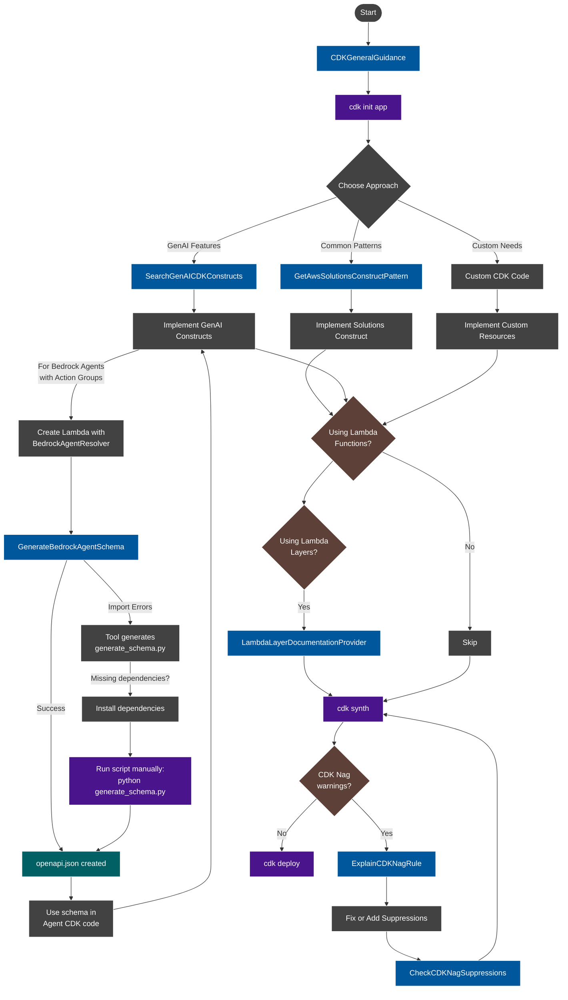

# AWS CDK MCP Server

MCP server for AWS Cloud Development Kit (CDK) best practices, infrastructure as code patterns, and security compliance with CDK Nag.

## Features

### CDK General Guidance

- Prescriptive patterns with AWS Solutions Constructs and GenAI CDK libraries
- Structured decision flow for choosing appropriate implementation approaches
- Security automation through CDK Nag integration and Lambda Powertools

### CDK Nag Integration

- Work with CDK Nag rules for security and compliance
- Explain specific CDK Nag rules with AWS Well-Architected guidance
- Check if CDK code contains Nag suppressions that require human review

### AWS Solutions Constructs

- Search and discover AWS Solutions Constructs patterns
- Find recommended patterns for common architecture needs
- Get detailed documentation on Solutions Constructs

### Generative AI CDK Constructs

- Search for GenAI CDK constructs by name or type
- Discover specialized constructs for AI/ML workloads
- Get implementation guidance for generative AI applications

### Lambda Layer Documentation Provider

- Access comprehensive documentation for AWS Lambda layers
- Get code examples for generic Lambda layers and Python-specific layers
- Retrieve directory structure information and implementation best practices
- Seamless integration with AWS Documentation MCP Server for detailed documentation

### Amazon Bedrock Agent Schema Generation

- Use this tool when creating Bedrock Agents with Action Groups that use Lambda functions
- Streamline the creation of Bedrock Agent schemas
- Convert code files to compatible OpenAPI specifications

#### Developer Notes

- **Requirements**: Your Lambda function must use `BedrockAgentResolver` from AWS Lambda Powertools
- **Lambda Dependencies**: If schema generation fails, a fallback script will be generated. If you see error messages about missing dependencies, install them and then run the script again.
- **Integration**: Use the generated schema with `bedrock.ApiSchema.fromLocalAsset()` in your CDK code

## CDK Implementation Workflow

This diagram provides a comprehensive view of the recommended CDK implementation workflow:



## Available MCP Tools

- **CDKGeneralGuidance**: Get prescriptive advice for building AWS applications with CDK
- **GetAwsSolutionsConstructPattern**: Find vetted architecture patterns combining AWS services
- **SearchGenAICDKConstructs**: Discover GenAI CDK constructs by name or features
- **GenerateBedrockAgentSchema**: Create OpenAPI schemas for Bedrock Agent action groups
- **LambdaLayerDocumentationProvider**: Access documentation for Lambda layers implementation
- **ExplainCDKNagRule**: Get detailed guidance on CDK Nag security rules
- **CheckCDKNagSuppressions**: Validate CDK Nag suppressions in your code

## Available MCP Resources

- **CDK Nag Rules**: Access rule packs via `cdk-nag://rules/{rule_pack}`
- **AWS Solutions Constructs**: Access patterns via `aws-solutions-constructs://{pattern_name}`
- **GenAI CDK Constructs**: Access documentation via `genai-cdk-constructs://{construct_type}/{construct_name}`
- **Lambda Powertools**: Get guidance on Lambda Powertools via `lambda-powertools://{topic}`

## Prerequisites

1. Install `uv` from [Astral](https://docs.astral.sh/uv/getting-started/installation/) or the [GitHub README](https://github.com/astral-sh/uv#installation)
2. Install Python using `uv python install 3.10`
3. Install AWS CDK CLI using `npm install -g aws-cdk` (Note: The MCP server itself doesn't use the CDK CLI directly, but it guides users through CDK application development that requires the CLI)

## Installation

Here are some ways you can work with MCP across AWS, and we'll be adding support to more products including Amazon Q Developer CLI soon: (e.g. for Amazon Q Developer CLI MCP, `~/.aws/amazonq/mcp.json`):

```json
{
  "mcpServers": {
    "awslabs.cdk-mcp-server": {
      "command": "uvx",
      "args": ["awslabs.cdk-mcp-server@latest"],
      "env": {
        "FASTMCP_LOG_LEVEL": "ERROR"
      },
      "disabled": false,
      "autoApprove": []
    }
  }
}
```

or docker after a successful `docker build -t awslabs/cdk-mcp-server .`:

```json
  {
    "mcpServers": {
      "awslabs.cdk-mcp-server": {
        "command": "docker",
        "args": [
          "run",
          "--rm",
          "--interactive",
          "--env",
          "FASTMCP_LOG_LEVEL=ERROR",
          "awslabs/cdk-mcp-server:latest"
        ],
        "env": {},
        "disabled": false,
        "autoApprove": []
      }
    }
  }
```

## Security Considerations

When using this MCP server, you should consider:

- Reviewing all CDK Nag warnings and errors manually
- Fixing security issues rather than suppressing them whenever possible
- Documenting clear justifications for any necessary suppressions
- Using the CheckCDKNagSuppressions tool to verify no unauthorized suppressions exist

Before applying CDK NAG Suppressions, you should consider conducting your own independent assessment to ensure that your use would comply with your own specific security and quality control practices and standards, as well as the local laws, rules, and regulations that govern you and your content.
