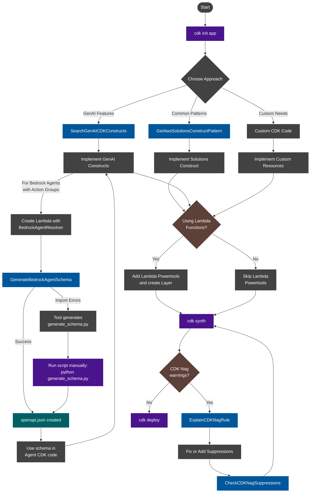

# AWS CDK General Guidance

This guide provides essential guidance for AWS CDK development, focusing on when to use specific constructs and tools.

## Getting Started with CDK

Always initialize CDK projects properly using the CDK CLI:

```bash
# For TypeScript projects
cdk init app --language typescript

# For Python projects
cdk init app --language python
```

Proper initialization ensures:

- Consistent project structure
- Correct dependency setup
- Appropriate tsconfig/package.json configuration
- Necessary boilerplate files

This foundation helps avoid common issues and ensures compatibility with the AWS CDK ecosystem.

## Development Workflow

When developing CDK applications, use these commands for an efficient workflow:

```bash
# Synthesize CloudFormation templates (recommended for validation)
cdk synth

# Deploy your CDK application
cdk deploy

# Compare deployed stack with current state
cdk diff
```

**Important**: Prefer `cdk synth` over `npm run build` or `tsc` for TypeScript projects. The `cdk synth` command:

- Automatically compiles TypeScript code when needed
- Validates CDK constructs and catches potential deployment issues
- Generates CloudFormation templates for inspection
- Provides more informative error messages for debugging

## Decision Flow for CDK Implementation

When implementing AWS infrastructure with CDK, consider these complementary approaches:

1. **For Common Architecture Patterns: AWS Solutions Constructs**
   - Use the `GetAwsSolutionsConstructPattern` tool to search for patterns that match your use case
   - Example: `GetAwsSolutionsConstructPattern(services=["lambda", "dynamodb"])`
   - AWS Solutions Constructs implement AWS best practices by default
   - For complete documentation: `aws-solutions-constructs://{pattern_name}`
   - Ideal for REST APIs, serverless backends, data processing pipelines, etc.

2. **For GenAI/AI/ML Use Cases: GenAI CDK Constructs**
   - Use the `SearchGenAICDKConstructs` tool for specialized AI/ML constructs
   - These simplify implementation of Bedrock, SageMaker, and other AI services
   - Perfect for agents, knowledge bases, vector stores, and other GenAI components

   **Installation:**

   ```typescript
   // TypeScript
   // Create or use an existing CDK application
   cdk init app --language typescript
   // Install the package
   npm install @cdklabs/generative-ai-cdk-constructs
   // Import the library
   import * as genai from '@cdklabs/generative-ai-cdk-constructs';
   ```

   ```python
   # Python
   # Create or use an existing CDK application
   cdk init app --language python
   # Install the package
   pip install cdklabs.generative-ai-cdk-constructs
   # Import the library
   import cdklabs.generative_ai_cdk_constructs
   ```

3. **For All Projects: Apply CDK Nag**
   - Always apply CDK Nag to ensure security best practices
   - Use the `ExplainCDKNagRule` tool to understand specific rules

4. **For Custom Requirements: Custom Implementation**
   - Create custom CDK code when no suitable constructs exist
   - Follow AWS Well-Architected best practices

> **IMPORTANT**: AWS Solutions Constructs and GenAI CDK Constructs are complementary and can be used together in the same project. For example, you might use GenAI CDK Constructs for Bedrock components and AWS Solutions Constructs for the REST API and database layers of your application.

## Key Principles

- **Security First**: Always implement security best practices by default
- **Cost Optimization**: Design resources to minimize costs while meeting requirements
- **Operational Excellence**: Implement proper monitoring, logging, and observability
- **Serverless-First**: Prefer serverless services when possible
- **Infrastructure as Code**: Use CDK to define all infrastructure
- **Use Vetted Patterns**: Prefer AWS Solutions Constructs over custom implementations
- **Regional Awareness**: Consider regional availability and constraints for services

## Amazon Bedrock Cross-Region Inference Profiles

When working with Amazon Bedrock foundation models, many models (including Claude models, Meta Llama models, and Amazon's own Nova models) require the use of inference profiles rather than direct on-demand usage in specific regions.

### Key Considerations

- **Required for Many Models**: Foundation models like Claude 3 often require inference profiles
- **Regional Configuration**: Profiles are configured for specific geographic regions (US, EU, APAC)
- **Error Prevention**: Prevents errors like "Invocation with on-demand throughput isn't supported"
- **Implementation**: Use the `CrossRegionInferenceProfile` class from the GenAI CDK constructs

For detailed implementation examples, see the `genai-cdk-constructs://bedrock/profiles` resource.

### Regional Considerations

- **Model Availability**: Not all foundation models are available in all regions
- **Performance**: Choose the region closest to your users for optimal latency
- **Compliance**: Consider data residency requirements when selecting regions

Always check the [Amazon Bedrock documentation](https://docs.aws.amazon.com/bedrock/latest/userguide/what-is-bedrock.html) for the latest information on model availability and regional constraints.

## AWS Solutions Constructs

AWS Solutions Constructs are vetted architecture patterns that combine multiple AWS services to solve common use cases following AWS Well-Architected best practices.

**Key benefits:**

- Accelerated Development: Implement common patterns without boilerplate code
- Best Practices Built-in: Security, reliability, and performance best practices
- Reduced Complexity: Simplified interfaces for multi-service architectures
- Well-Architected: Patterns follow AWS Well-Architected Framework principles

**When to use Solutions Constructs:**

- Implementing common architecture patterns (e.g., API + Lambda + DynamoDB)
- You want secure defaults and best practices applied automatically
- You need to quickly prototype or build production-ready infrastructure

To discover available patterns, use the `GetAwsSolutionsConstructPattern` tool.

## Security with CDK Nag

CDK Nag ensures your CDK applications follow AWS security best practices. **Always apply CDK Nag to all stacks.**

**When to use CDK Nag tools:**
- **ExplainCDKNagRule**: When encountering warnings that need remediation
- **CheckCDKNagSuppressions**: During code reviews to verify suppression justifications

Key security practices:
- Follow least privilege for IAM
- Secure S3 buckets with encryption and access controls
- Implement secure authentication with Cognito
- Secure API Gateway endpoints with proper authorization

## Operational Excellence with Lambda Powertools

**Always implement Lambda Powertools** for structured logging, tracing, and metrics. For detailed guidance, use the `lambda-powertools://cdk` resource.

## Tool Selection Guide

Match CDK tasks to appropriate tools:

| Task | Tool | Common Mistakes |
|------|------|-----------------|
| Generate Bedrock Agent schema | GenerateBedrockAgentSchema | ❌ Missing schema generation or not running script to create openapi.json |
| Understand CDK Nag rules | ExplainCDKNagRule | ❌ Ignoring security warnings without understanding remediation steps |
| Find architecture patterns | GetAwsSolutionsConstructPattern | ❌ Building common patterns from scratch instead of using vetted constructs |
| Implement GenAI features | SearchGenAICDKConstructs | ❌ Building GenAI components without specialized constructs |
| Add Lambda observability | lambda-powertools://cdk | ❌ Missing Layer creation, structured logging and monitoring |
| Audit CDK Nag suppressions | CheckCDKNagSuppressions | ❌ Insufficient documentation for security suppressions |

## Lambda Powertools Implementation

> **CRITICAL:** All Lambda functions should implement Lambda Powertools for proper observability.

**Key requirements:**
- Use language-specific constructs (PythonFunction, NodejsFunction)
- Include Powertools dependencies with appropriate extras
- Configure required environment variables
- Create Lambda layers when needed

**Example Lambda layer for Python:**
```typescript
const lambdaPowertoolsLayer = new PythonLayerVersion(this, "LambdaPowertoolsLayer", {
  entry: path.join("src", "layers", "aws_lambda_powertools"),
  compatibleRuntimes: [Runtime.PYTHON_3_13],
  description: "Lambda Powertools for Python",
});
```

For complete implementation details and examples for all languages, see the [lambda-powertools://cdk](lambda-powertools://cdk) resource.

## CDK Implementation Workflow



## Available MCP Tools

This MCP server provides several tools to help you implement AWS CDK best practices:

1. **CDKGeneralGuidance**: This document - general CDK best practices
2. **ExplainCDKNagRule**: Explain a specific CDK Nag rule with AWS Well-Architected guidance
3. **CheckCDKNagSuppressions**: Check if CDK code contains Nag suppressions that require human review
4. **GenerateBedrockAgentSchema**: Generate OpenAPI schema for Bedrock Agent Action Groups from Lambda functions
5. **GetAwsSolutionsConstructPattern**: Search and discover AWS Solutions Constructs patterns
6. **SearchGenAICDKConstructs**: Search for GenAI CDK constructs by name or type

## Available MCP Resources

This MCP server also provides several resources for accessing documentation:

1. **cdk-nag://rules/{rule_pack}**: Get all rules for a specific CDK Nag rule pack
2. **cdk-nag://warnings/{rule_pack}**: Get warnings for a specific CDK Nag rule pack
3. **cdk-nag://errors/{rule_pack}**: Get errors for a specific CDK Nag rule pack
4. **lambda-powertools://{topic}**: Get Lambda Powertools guidance on a specific topic
5. **aws-solutions-constructs://{pattern_name}**: Get complete documentation for an AWS Solutions Constructs pattern
6. **genai-cdk-constructs://{construct_type}/{construct_name}**: Get documentation for a GenAI CDK construct

Always check for these tools and resources when implementing CDK infrastructure to ensure you're following AWS best practices.
