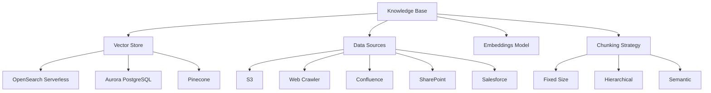

# Amazon Bedrock Knowledge Bases

Amazon Bedrock Knowledge Bases enable you to provide foundation models and agents with contextual information from your company's private data sources. This enhances the relevance, accuracy, and customization of their responses.

## Table of Contents

- [Amazon Bedrock Knowledge Bases](#amazon-bedrock-knowledge-bases)
  - [Table of Contents](#table-of-contents)
  - [Key Concepts](#key-concepts)
  - [Knowledge Base Types](#knowledge-base-types)
  - [Knowledge Base Components](#knowledge-base-components)
  - [When to Use Knowledge Bases](#when-to-use-knowledge-bases)
  - [Related Resources](#related-resources)
  - [Quick Start Example](#quick-start-example)
    - [Next Steps](#next-steps)

## Key Concepts

- **Knowledge Base**: A repository of information that foundation models can access to provide context-aware responses
- **Vector Store**: A specialized database that stores and retrieves text as vector embeddings
- **Chunking**: The process of breaking documents into smaller pieces for efficient storage and retrieval
- **Data Source**: The origin of information ingested into a knowledge base (S3, web crawler, etc.)
- **Embeddings Model**: A model that converts text into vector representations

## Knowledge Base Types

- **Vector Knowledge Base**: Uses vector embeddings to find semantically similar content (most common)
- **Kendra Knowledge Base**: Leverages Amazon Kendra's semantic search capabilities
- **Structured Data Retrieval**: Enables querying structured data sources (coming soon)

> **Note**: Vector Knowledge Base is the most common type and currently has the most comprehensive support in the GenAI CDK. See [Vector Knowledge Base Creation](vector/creation.md) to get started.

## Knowledge Base Components



## When to Use Knowledge Bases

- **Domain-Specific Knowledge**: Provide specialized information not in the model's training data
- **Private Information**: Allow models to access your organization's proprietary information
- **Up-to-Date Information**: Supply models with the latest information beyond their training cutoff
- **RAG Applications**: Implement Retrieval Augmented Generation for more accurate responses

## Related Resources

- **Chunking Strategies**: `genai-cdk-constructs://bedrock/knowledgebases/chunking`
- **Data Sources**: `genai-cdk-constructs://bedrock/knowledgebases/datasources`
- **Kendra Integration**: `genai-cdk-constructs://bedrock/knowledgebases/kendra`
- **Parsing Strategies**: `genai-cdk-constructs://bedrock/knowledgebases/parsing`
- **Custom Transformations**: `genai-cdk-constructs://bedrock/knowledgebases/transformation`
- **Vector Stores**:
  - `genai-cdk-constructs://bedrock/knowledgebases/vector/creation`
  - `genai-cdk-constructs://bedrock/knowledgebases/vector/opensearch`
  - `genai-cdk-constructs://bedrock/knowledgebases/vector/aurora`
  - `genai-cdk-constructs://bedrock/knowledgebases/vector/pinecone`

## Quick Start Example

```typescript
import { bedrock } from '@cdklabs/generative-ai-cdk-constructs';
import * as s3 from 'aws-cdk-lib/aws-s3';

// Create a vector knowledge base
const kb = new bedrock.VectorKnowledgeBase(this, 'KnowledgeBase', {
  // Use TITAN_EMBED_TEXT_V2 with appropriate dimension size based on your needs:
  // - 256: Fastest, lowest storage requirements, good for simple use cases
  // - 512: Balanced performance and accuracy, recommended for most use cases
  // - 1024: Highest accuracy, best for complex semantic relationships
  embeddingsModel: bedrock.BedrockFoundationModel.TITAN_EMBED_TEXT_V2_512,
  instruction: 'Use this knowledge base to answer questions about our company policies.',
});

// Create a secure S3 bucket for data
const dataBucket = new s3.Bucket(this, 'DataBucket');

// Add an S3 data source with chunking strategy
new bedrock.S3DataSource(this, 'DataSource', {
  bucket: dataBucket,
  knowledgeBase: kb,
  dataSourceName: 'CompanyPolicies',
  chunkingStrategy: bedrock.ChunkingStrategy.fixedSize({
    maxTokens: 300,
    overlapPercentage: 20,
  }),
});

// Note: When choosing an embedding model version:
// - TITAN_EMBED_TEXT_V2_256: Lower dimension, faster, smaller storage footprint
// - TITAN_EMBED_TEXT_V2_512: Balanced performance and accuracy (recommended)
// - TITAN_EMBED_TEXT_V2_1024: Higher dimension, more accurate but more expensive

### Next Steps

For more detailed information:

- [Vector Knowledge Base Creation](vector/creation.md) - Detailed properties and configuration options
- [Vector Stores](vector/opensearch.md) - Different vector store options (OpenSearch, Aurora, Pinecone)
- [Chunking Strategies](chunking.md) - Options for chunking your data
- [Data Sources](datasources.md) - Different data source types and configuration
