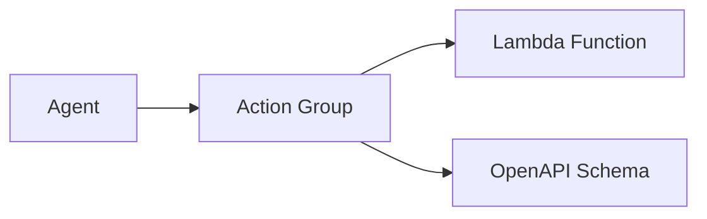

# Action Groups

## Overview

Action groups define functions your agent can call, connecting Bedrock Agents to your business logic via Lambda functions. The agent uses an OpenAPI schema to understand what your functions do and how to call them.



## Action Group Properties

| Name | Type | Required | Description |
|---|---|---|---|
| name | string | Yes | The name of the action group |
| description | string | No | A description of the action group |
| apiSchema | ApiSchema | No | The API Schema |
| executor | ActionGroupExecutor | No | The action group executor |
| enabled | boolean | No | Specifies whether the action group is available for the agent to invoke or not when sending an InvokeAgent request. Defaults to true |
| forceDelete | boolean | No | Specifies whether to delete the resource even if it's in use. Defaults to false |
| functionSchema | CfnAgent.FunctionSchemaProperty | No | Defines functions that each define parameters that the agent needs to invoke from the user |
| parentActionGroupSignature | ParentActionGroupSignature | No | The AWS Defined signature for enabling certain capabilities in your agent. When specified, description, apiSchema, and actionGroupExecutor must be blank |

## OpenAPI Schema Generation & Best Practices

For Action Groups, use the built-in OpenAPI schema generation tool provided by the AWS CDK MCP server:

```typescript
// Using MCP client
const result = await use_mcp_tool({
  server_name: "awslabs.cdk-mcp-server",
  tool_name: "GenerateBedrockAgentSchemaFromFile",
  arguments: {
    lambda_code_path: "path/to/your/lambda.py",
    output_path: "path/to/output/openapi.json"
  }
});
```

The tool will:

1. Parse your Lambda function code
2. Extract function signatures and docstrings
3. Generate a Bedrock-compatible OpenAPI schema
4. Save it to the specified output path

### Key Requirements
- Ensure each operation has a unique operationId
- Define complete response schemas
- Use `fromLocalAsset` (not `fromAsset`) for API schemas
- Include detailed descriptions for all endpoints, parameters, and return values
- Use proper type annotations with Python type hints

### Lambda Function Example

```python
from aws_lambda_powertools.event_handler import BedrockAgentResolver
from typing import Annotated, List
from aws_lambda_powertools.event_handler.openapi.params import Query, Path
from pydantic import BaseModel, Field

app = BedrockAgentResolver()

class Product(BaseModel):
    product_id: str = Field(description="Unique product identifier")
    name: str = Field(description="Product name")
    price: float = Field(description="Product price in USD")

@app.get("/products", description="List available products")
def list_products(
    category: Annotated[str, Query(description="Product category")] = None
) -> List[Product]:
    # Your business logic here
    return [Product(product_id="1", name="Product A", price=19.99)]

def lambda_handler(event, context):
    return app.resolve(event, context)
```

## Examples

### TypeScript

```ts
const actionGroupFunction = new lambda_python.PythonFunction(this, 'ActionGroupFunction', {
  runtime: lambda.Runtime.PYTHON_3_12,
  entry: path.join(__dirname, '../lambda/action-group'),
});

// Example of proper Action Group setup with fromLocalAsset
const actionGroup = new AgentActionGroup({
  name: 'query-library',
  description: 'Use these functions to get information about the books in the library.',
  executor: bedrock.ActionGroupExecutor.fromlambdaFunction(actionGroupFunction),
  enabled: true,
  apiSchema: bedrock.ApiSchema.fromLocalAsset(path.join(__dirname, 'action-group.yaml')),
});

agent.addActionGroup(actionGroup);

// Real-world example with account actions
const agentAccountActions = new AgentActionGroup({
  name: "agent-account-actions",
  description: "Use these functions to take actions on authenticated user's accounts",
  executor: bedrock.ActionGroupExecutor.fromlambdaFunction(accountActionsLambda),
  apiSchema: bedrock.ApiSchema.fromLocalAsset(
    path.join(agentsLambdaDir, "account_actions", "openapi.json"),
  ),
});

agent.addActionGroup(agentAccountActions);
```

### Python

```python
action_group_function = PythonFunction(
            self,
            "LambdaFunction",
            runtime=Runtime.PYTHON_3_12,
            entry="./lambda",
            index="app.py",
            handler="lambda_handler",
)

actionGroup = bedrock.AgentActionGroup(
    name="query-library",
    description="Use these functions to get information about the books in the library.",
    executor= bedrock.ActionGroupExecutor.fromlambda_function(action_group_function),
    enabled=True,
    api_schema=bedrock.ApiSchema.from_local_asset("action-group.yaml"))

agent.add_action_group(actionGroup)
```
