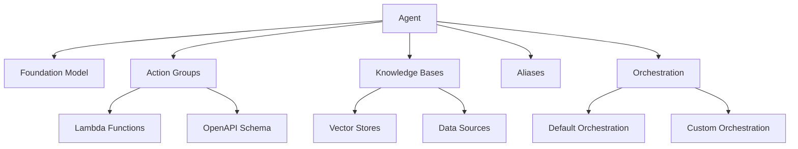

# Amazon Bedrock Agents

Amazon Bedrock Agents enable you to build AI assistants that can perform tasks by connecting foundation models to your data sources, APIs, and business systems.

## Table of Contents

- [Amazon Bedrock Agents](#amazon-bedrock-agents)
  - [Table of Contents](#table-of-contents)
  - [Key Concepts](#key-concepts)
  - [Agent Components](#agent-components)
  - [When to Use Agents](#when-to-use-agents)
  - [Related Resources](#related-resources)
  - [Quick Start Example](#quick-start-example)

## Key Concepts

- **Agent**: An AI assistant that uses foundation models to understand user requests and take actions
- **Action Groups**: Functions your agent can call, defined by OpenAPI schemas and executed by Lambda functions
- **Knowledge Bases**: Data sources that provide context to your agent
- **Aliases**: Deployment targets for your agent, pointing to specific versions
- **Orchestration**: The process of coordinating agent interactions with action groups and knowledge bases

## Agent Components



## When to Use Agents

- **Task Automation**: Create assistants that can perform tasks like booking appointments or processing orders
- **Data-Driven Conversations**: Build agents that can answer questions using your organization's data
- **Multi-Step Workflows**: Implement complex workflows that require multiple steps and decisions
- **System Integration**: Connect foundation models to your existing systems and APIs

## Related Resources

- **Action Groups**: `genai-cdk-constructs://bedrock/agent/actiongroups`
- **Agent Aliases**: `genai-cdk-constructs://bedrock/agent/alias`
- **Agent Creation**: `genai-cdk-constructs://bedrock/agent/creation`
- **Agent Collaboration**: `genai-cdk-constructs://bedrock/agent/collaboration`
- **Custom Orchestration**: `genai-cdk-constructs://bedrock/agent/custom_orchestration`
- **Prompt Overrides**: `genai-cdk-constructs://bedrock/agent/prompt_override`

## Quick Start Example

```typescript
import { bedrock } from '@cdklabs/generative-ai-cdk-constructs';

// Create a basic agent
const agent = new bedrock.Agent(this, 'Agent', {
  foundationModel: bedrock.BedrockFoundationModel.ANTHROPIC_CLAUDE_3_5_HAIKU_V1_0,
  instruction: 'You are a helpful assistant that answers questions about our company.',
  shouldPrepareAgent: true,
});

// Add a knowledge base
agent.addKnowledgeBase(knowledgeBase);

// Add an action group
agent.addActionGroup(actionGroup);

// Create an alias for deployment
const agentAlias = new bedrock.AgentAlias(this, 'AgentAlias', {
  aliasName: 'latest',
  agent: agent,
});
